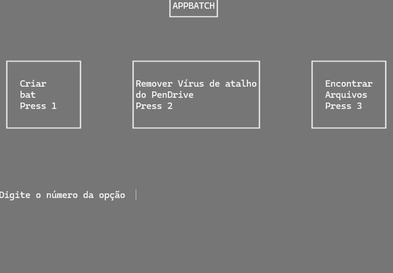
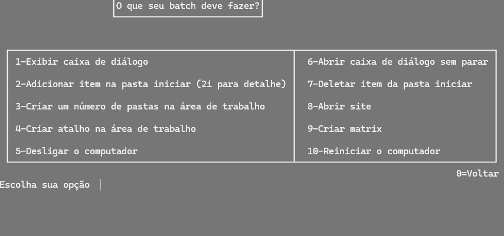

# AppBatch

AppBatch is a simple yet functional project that I created during my childhood and early teenage years. It demonstrates basic functionality using Windows batch scripts (.bat). This project provides an intuitive interface to perform three main tasks: creating batch scripts, removing shortcut viruses from pen drives, and finding files.

## Features

1. **Create Batch Script**
   - Users can create batch scripts by selecting from predefined options. This feature simplifies the process of batch script creation for common tasks.

2. **Remove Shortcut Virus from Pen Drive**
   - This option helps in removing the common shortcut virus from pen drives, ensuring the safety and accessibility of your files.

3. **Find Files**
   - Allows users to search and find files on their system efficiently.

## Interface

### Home Screen

The home screen presents three main options for the user to select from:



### Create Batch Script

In the create batch script section, users can choose from predefined scripts. This makes it easy for users, especially beginners, to generate useful batch scripts without needing to write any code manually.



## Getting Started

To get started with AppBatch, follow these steps:

1. Clone the repository to your local machine.
   ```bash
   git clone https://github.com/AlexsanderMe/appbatch.git
   ```
2. Navigate to the project directory.
   ```bash
   cd appbatch
   ```
3. Run the main batch file.
   ```bash
   AppBatch.bat
   ```


## License

This project is licensed under the MIT License - see the [LICENSE](LICENSE) file for details.

## Acknowledgments

This project is a nostalgic piece of work that I created during the early stages of my programming journey. It demonstrates the power and simplicity of batch scripting in automating tasks on Windows.
